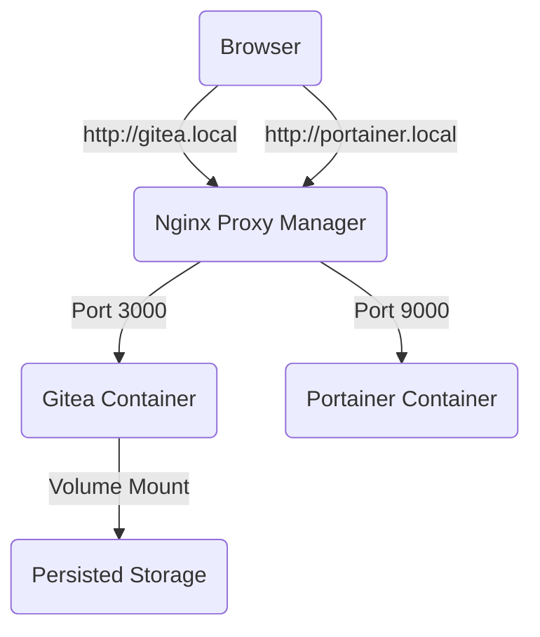
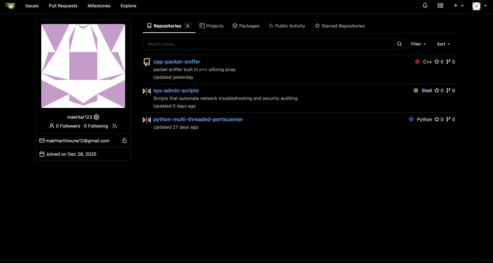
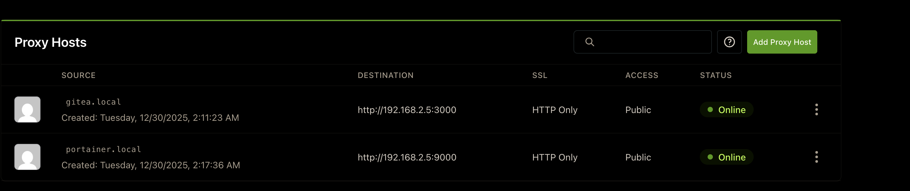
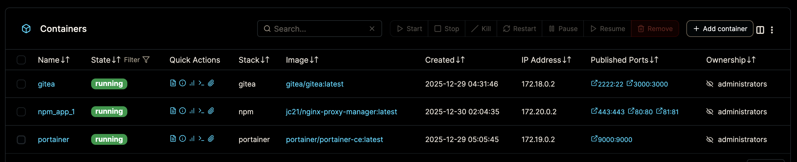

# 🚀 Self-Hosted DevOps Infrastructure (Homelab)

   

### 📖 Project Overview
This repository documents my local homelab environment, designed to simulate enterprise DevOps workflows using containerization and virtualization.

**Infrastructure Specs:**
*   **Host Environment:** Ubuntu 24.04.3 LTS (virtualized via Canonical Multipass).
*   **Resource Constraints:** Optimized to run on 2 vCPUs and 2GB RAM.
*   **Network Strategy:** Private internal network with Reverse Proxy routing.

---

### 🏗 Architecture

The system uses a microservices architecture where each service runs in an isolated container, managed by Docker Compose. Traffic is handled by a reverse proxy (Nginx) which performs SSL termination and routes requests based on domain headers.


### Deployment Instructions
If you want to replicate this setup locally, follow these steps:

**1. Prerequisites**
*   Canonical Multipass installed
*   Terminal access

**2. Provision the VM**
```bash
# Launch a VM with constrained resources (Simulating a cheap VPS)
multipass launch --name homelab --cpus 2 --memory 2G --disk 20G
multipass shell homelab
```
**3. Install Dependencies (Inside VM)**
```bash
# Update and install Docker Engine
sudo apt update && sudo apt install docker.io docker-compose -y
sudo usermod -aG docker ubuntu
# (Log out and back in to apply permissions)
```
**4. Deploy the Stack**
```bash
# Clone this repository
git clone https://github.com/makhtar123/my-homelab-infrastructure.git
cd my-homelab-infrastructure

# Bring up the services
docker-compose -f docker-compose-gitea.yml up -d
docker-compose -f docker-compose-nginx.yml up -d
docker-compose -f docker-compose-portainer.yml up -d
```

### 🛠 Tech Stack & Configuration

| Component | Technology | Purpose | Key Configuration |
| :--- | :--- | :--- | :--- |
| **Orchestration** | **Docker Compose** | Defining infrastructure as code | `restart: unless-stopped`, Custom Networks |
| **Version Control** | **Gitea** | Self-hosted Git server | SQLite3 (low memory footprint), SSH on port 2222 |
| **Edge Router** | **Nginx Proxy Manager** | Reverse Proxy & SSL | Block Common Exploits enabled, Custom DNS mapping |
| **Management** | **Portainer CE** | Container visualization | Mounted `docker.sock` for host control |
| **Virtualization** | **Multipass** | KVM-based Linux VM | Cloud-init simulation |

### 📸 Proof of Implementation
#### 1. The Git Server (Gitea)
Running locally on 192.168.2.5:3000 accessible via gitea.local

#### 2. Network Routing/Reverse Proxy (Nginx Proxy Manager)
Configuration of Reverse Proxy to mask internal ports (3000/9000)

#### 3. Container Managment (Portainer)
Portainer dashboard showing running services


### 💡 Key Challenges & Solutions
#### 1. Resource Optimization
> **Challenge:** Running a full Git suite and Management stack on a limited 2GB RAM VM.
>
> **Solution:** Chose Gitea over GitLab (Go vs Ruby) for a smaller footprint and utilized SQLite3 which eliminated the overhead of a dedicated MySQL container.

#### 2. Networking & DNS
> **Challenge:** Accessing containers via friendly names (`gitea.local`) without a real DNS server.
>
> **Solution:** Configured Nginx as a Reverse Proxy and modified the host machine's `/etc/hosts` file to map the VM's RFC1918 private IP to the custom `.local` domains.

#### 3. SSH Port Conflicts
> **Challenge:** The Host VM uses Port 22 for administrative access, preventing Gitea from using the standard Git SSH port.
>
> **Solution:** Mapped Gitea's internal port 22 to external port 2222 in Docker Compose and updated the app.ini configuration to ensure clone URLs are generated correctly